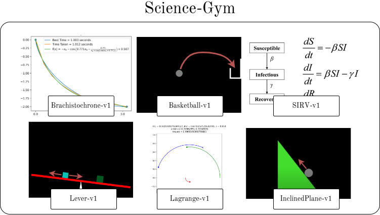

# Science-gym

Science-gym is a testbed for automated scientific discovery agents. It collects RL-like environments of physical systems and evaluates algorithms in their capabilities to discover the equations that govern them.

Full documentation is available at https://pibborn.github.io/Science-gym.
